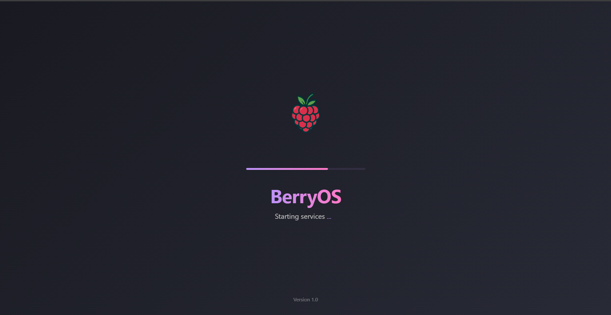
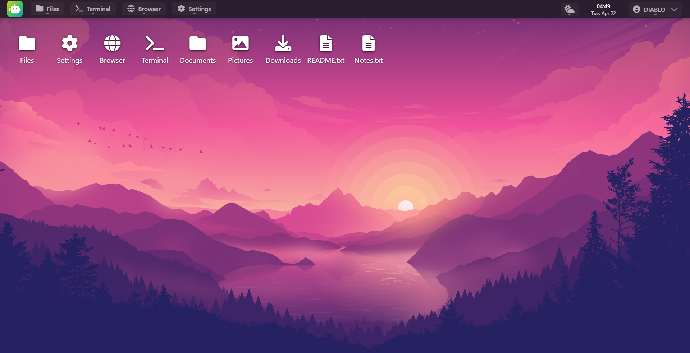

# 🍓 BerryOS – A Web-Based Desktop Operating System



**BerryOS** brings the look and feel of a real operating system to the browser! Built with ⚛️ **React** on the frontend and 🐍 **Python** on the backend, it offers a fully immersive desktop experience — now with 🌦️ **Weather Widgets** and 🤖 **AI Assistant** support!

---

## 🚀 Features

- 🪟 **Desktop Environment** – Drag, resize, minimize, and manage multiple application windows
- 📁 **File Explorer** – Create, rename, delete, copy, and move files and folders
- 🧑‍💻 **Linux-style Terminal** – Run basic shell commands like `ls`, `cd`, `echo`, `date`, and `clear`
- 🌐 **Integrated Browser** – Real web browsing with Python-based proxy, iframe, and screenshot modes
- 📝 **Notepad App** – A simple writing space for your ideas and notes
- ⚙️ **Settings** – Customize the desktop environment and app behavior
- 🌦️ **Weather App** – Get your local weather with real-time data from weather APIs
- 🤖 **AI Assistant** – Your virtual desktop assistant powered by AI for help, reminders, and quick actions
- 🖱️ **Context Menus** – Right-click support on desktop and files
- 🔄 **Multi-window System** – Switch between apps like a real OS

---

## 📸 Screenshots

### 🌐 Desktop Interface


---

## 🧑‍💻 Getting Started

### 🔹 Frontend (React)

1. 📦 Install dependencies:
   ```bash
   npm install
   ```
2. 🚀 Start the development server:
   ```bash
   npm run dev
   ```
3. 🔗 Open the app in your browser: http://localhost:5173

### 🔸 Backend (Python Proxy for Browser)
Used to enable full-featured website browsing via a proxy server.

1. 📂 Go to the backend folder:
   ```bash
   cd backend
   ```
2. 📥 Install Python dependencies:
   ```bash
   pip install -r requirements.txt
   ```
3. ▶️ Start the Python server:
   ```bash
   python app/main.py
   ```
   ✅ On Windows, just double-click start_backend.bat to run.

4. 🔗 Backend will be running at: http://localhost:5000

## 🌍 Browser Modes

- 🌀 **Proxy Mode** – Enables full website browsing using the Python proxy
- 🧊 **Iframe Mode** – Directly embed websites (subject to CORS policies)
- 📷 **Preview Mode** – Displays screenshot thumbnails of websites

Switch between modes using toggle buttons in the browser.

## 🧭 Usage

- 🖱️ Double-click icons to open apps
- ➕ Open multiple apps and drag windows around
- 📁 Use File Explorer to manage files with right-click options
- ⬛ Terminal Commands: ls, cd, help, echo, date, clear
- 🤖 AI Assistant: Ask questions, set reminders, and get help on the OS!
- 🌦️ Weather App: Auto-detects location and shows current conditions

## 🧩 Architecture

| Component | Stack |
|-----------|-------|
| 💻 Frontend | React + Vite + Hooks |
| 🐍 Backend | Python (Flask Proxy Server) |
| 🎨 UI Styling | CSS + Inline Styles |
| 🧠 AI Support | OpenAI / LLM (Configurable) |
| 🌦️ Weather | Weather API (OpenWeatherMap) |

## 🔐 Security Notice

The Python backend proxy is for development and educational use only. It bypasses standard web security mechanisms (CORS, cookies, sessions) and should not be used for secure or sensitive browsing.

## 🤝 Contributing

We welcome all contributions! 🧑‍💻 Whether it's a new app, feature, or bug fix—submit a pull request and join the BerryOS builders.

## 📄 License

MIT License © 2025

Feel free to fork, modify, and build your own web OS!
